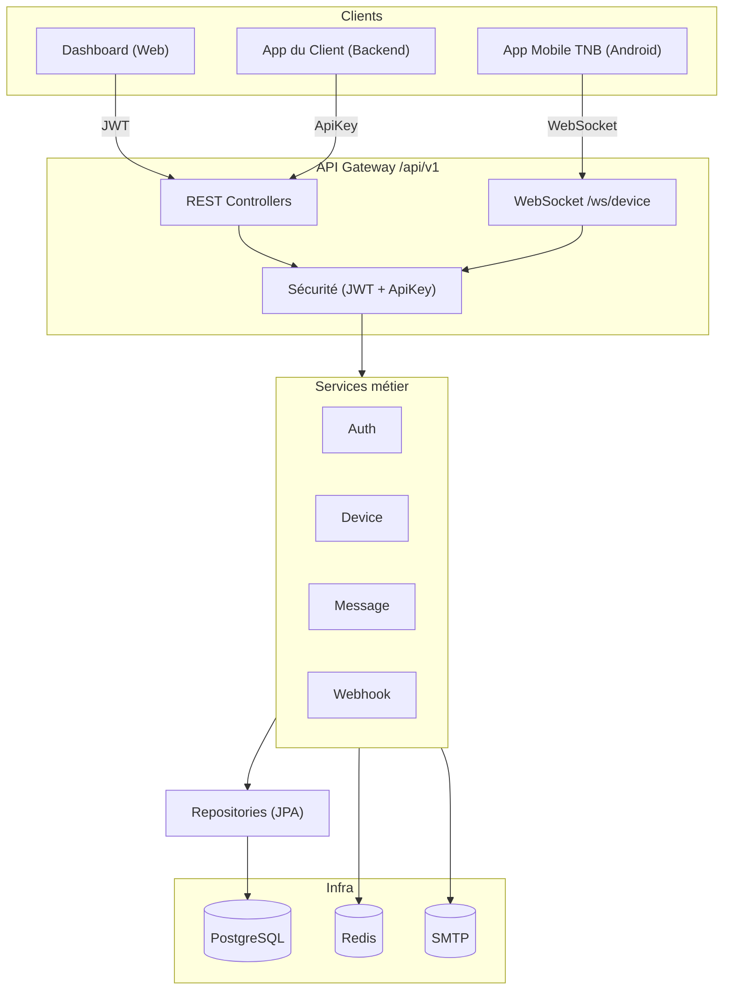
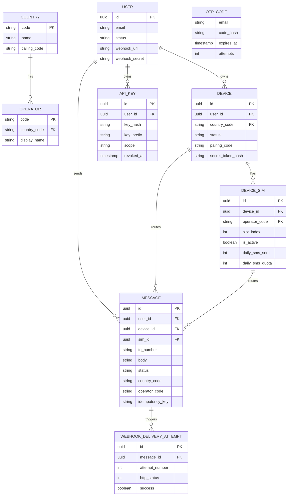
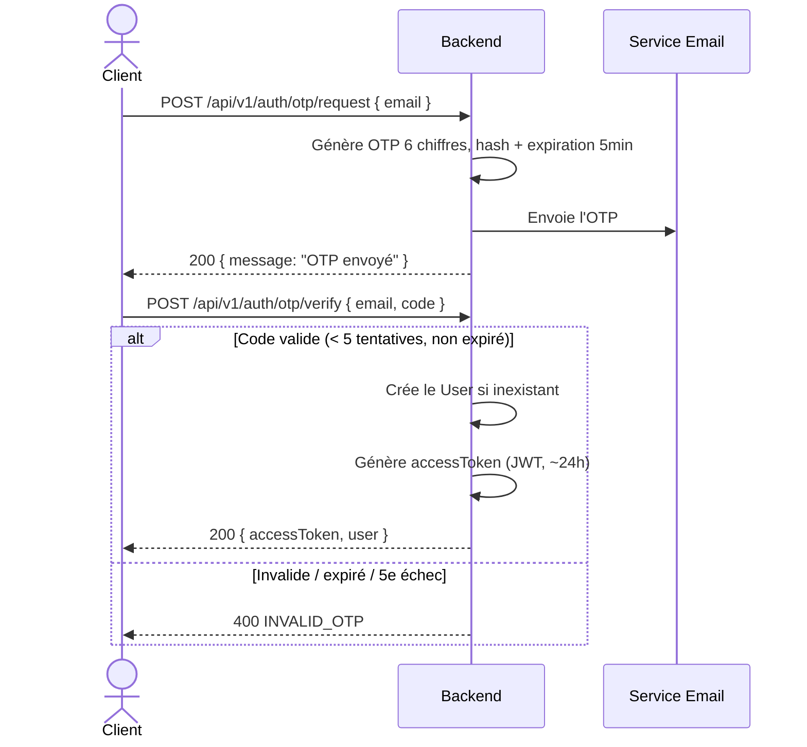
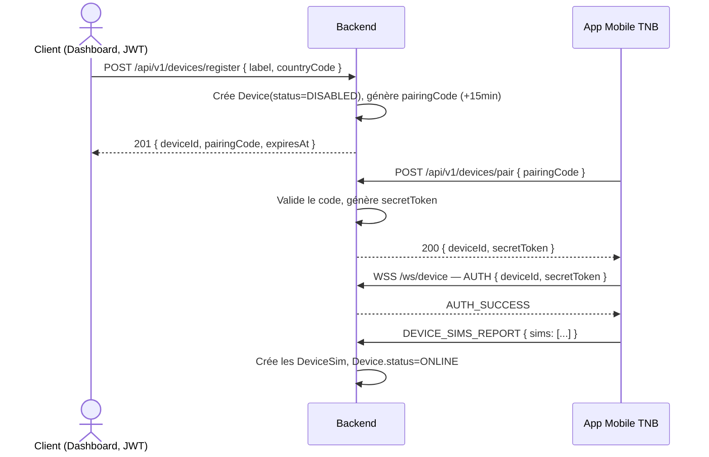
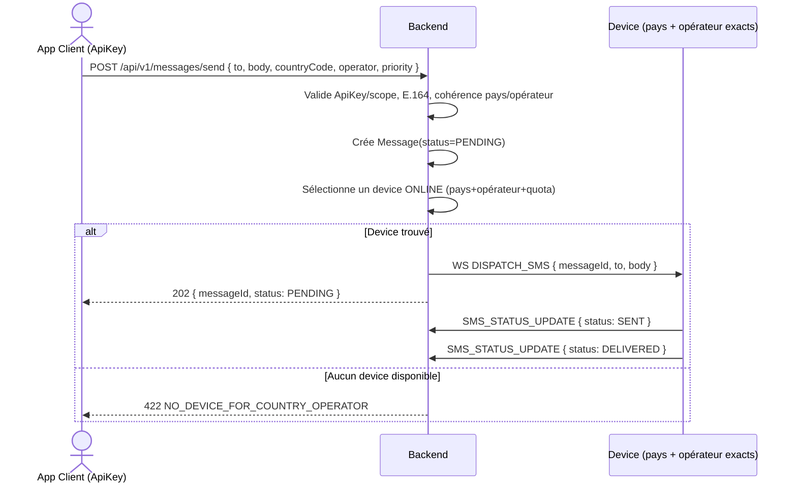
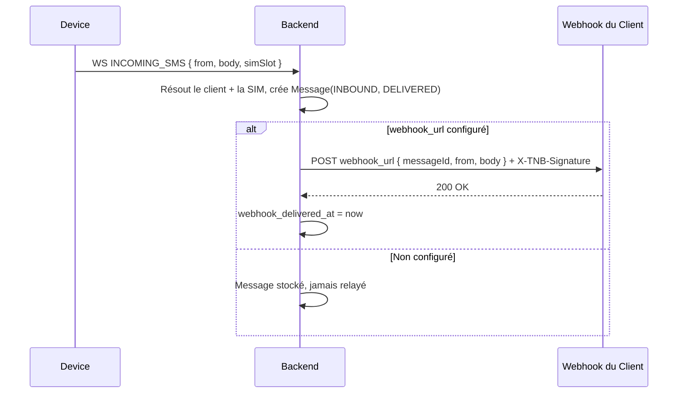
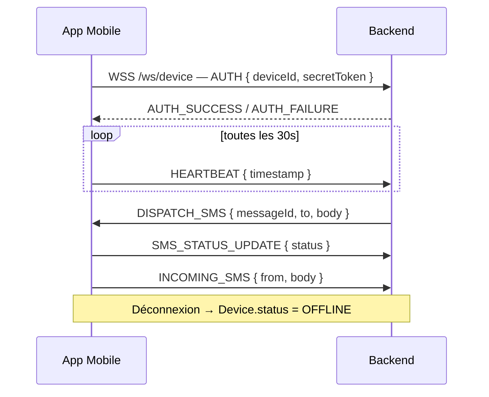

# TNB SMS Gateway

**Plateforme SaaS d'envoi/réception de SMS multi-pays, multi-opérateur (BYOD)**

[](https://adoptium.net/)
[](https://spring.io/projects/spring-boot)
[](https://www.postgresql.org/)
[](LICENSE)

---

## Table des matières

1. [Présentation](#présentation)
2. [Architecture](#architecture)
3. [Technologies](#technologies)
4. [Structure du projet](#structure-du-projet)
5. [Modèle de données](#modèle-de-données)
6. [Flux et scénarios](#flux-et-scénarios)
7. [API REST](#api-rest)
8. [WebSocket](#websocket)
9. [Installation](#installation)
10. [Configuration et profils](#configuration-et-profils)
11. [Docker](#docker)
12. [Documentation Swagger](#documentation-swagger)
13. [Variables d'environnement](#variables-denvironnement)
14. [Contributeurs](#contributeurs)

---

## Présentation

**TNB SMS Gateway** est une plateforme SaaS permettant aux entreprises d'envoyer et de recevoir des SMS via leurs propres devices Android (modèle **BYOD — Bring Your Own Device**).

### Fonctionnalités clés

- ✅ **Authentification OTP** — connexion sans mot de passe, par email + code à usage unique
- ✅ **BYOD** — chaque client enregistre ses propres smartphones Android comme passerelles SMS
- ✅ **Multi-pays** — devices rattachés à un pays précis (CM, SN, FR, ...)
- ✅ **Multi-opérateur** — routage explicite par opérateur (MTN, Orange, Free, ...)
- ✅ **API REST** — intégration simple dans n'importe quelle application cliente
- ✅ **WebSocket** — communication temps réel avec les devices (dispatch, statuts, SMS entrants)
- ✅ **Webhook signé** — réception des SMS entrants sur le serveur du client, avec signature HMAC
- ✅ **Clés API scopées** — `FULL` / `SEND_ONLY` / `READ_ONLY`, révocables immédiatement

### Cas d'usage

| Usage | Exemple |
|---|---|
| 🔐 Authentification 2FA | Code de vérification envoyé par SMS |
| 📦 Notifications transactionnelles | Confirmation de commande, alerte de livraison |
| 📊 Campagnes marketing | Envoi de SMS promotionnels ciblés |
| 🏢 Communication d'entreprise | Notifications internes/externes |
| 🌍 Couverture internationale | Un seul point d'intégration pour plusieurs pays |

---

## Architecture



---

## Technologies

| Catégorie | Technologie | Version |
|---|---|---|
| Langage | Java | 17 |
| Framework | Spring Boot | 3.2.0 |
| Sécurité | Spring Security + JWT (stateless, sans refresh token) | — |
| Base de données | PostgreSQL | 16 |
| Cache / rate limiting | Redis | 7 |
| ORM | Spring Data JPA (Hibernate) | — |
| Temps réel | Spring WebSocket | — |
| Documentation API | SpringDoc OpenAPI | 2.3.0 |
| Migrations DB | Flyway | — |
| Build | Maven | 3.9+ |
| Conteneurisation | Docker + Docker Compose | — |

---

## Structure du projet

```text
TNB.SmsGateway/
├── src/main/java/TNB/SmsGateway/
│   ├── TnbSmsGatewayApplication.java     # Point d'entrée
│   │
│   ├── config/                           # Configurations
│   │   ├── SecurityConfig.java
│   │   ├── SwaggerConfig.java
│   │   ├── AppConfig.java
│   │   ├── CorsConfig.java
│   │   ├── AsyncConfig.java
│   │   └── DatabaseConfig.java
│   │
│   ├── controller/                       # Controllers REST
│   │   ├── AuthController.java
│   │   ├── WebhookController.java
│   │   ├── ApiKeyController.java
│   │   ├── ReferenceController.java
│   │   ├── DeviceController.java
│   │   ├── MessageController.java
│   │   ├── CoverageController.java
│   │   └── HealthController.java
│   │
│   ├── service/                          # Logique métier
│   │   ├── AuthService.java
│   │   ├── OtpService.java
│   │   ├── UserService.java
│   │   ├── ApiKeyService.java
│   │   ├── DeviceService.java
│   │   ├── DevicePairingService.java
│   │   ├── DeviceSimService.java
│   │   ├── DeviceStatusService.java
│   │   ├── ReferenceService.java
│   │   ├── MessageService.java
│   │   ├── MessageRouterService.java
│   │   ├── WebhookService.java
│   │   ├── CoverageService.java
│   │   ├── IncomingMessageService.java
│   │   └── ScheduleService.java
│   │
│   ├── repository/                       # Accès données (JPA)
│   │   ├── UserRepository.java
│   │   ├── OtpCodeRepository.java
│   │   ├── ApiKeyRepository.java
│   │   ├── CountryRepository.java
│   │   ├── OperatorRepository.java
│   │   ├── DeviceRepository.java
│   │   ├── DeviceSimRepository.java
│   │   ├── MessageRepository.java
│   │   └── WebhookDeliveryAttemptRepository.java
│   │
│   ├── entity/                           # Entités JPA
│   │   ├── audit/BaseAudit.java
│   │   ├── User.java
│   │   ├── OtpCode.java
│   │   ├── ApiKey.java
│   │   ├── Country.java
│   │   ├── Operator.java
│   │   ├── Device.java
│   │   ├── DeviceSim.java
│   │   ├── Message.java
│   │   └── WebhookDeliveryAttempt.java
│   │
│   ├── dto/
│   │   ├── request/                      # OtpRequest, DeviceRegisterRequest, SendMessageRequest, ...
│   │   └── response/                     # AuthResponse, DeviceResponse, MessageResponse, ...
│   │
│   ├── websocket/
│   │   ├── config/WebSocketConfig.java
│   │   ├── handler/DeviceWebSocketHandler.java
│   │   ├── session/DeviceSessionManager.java
│   │   ├── interceptor/WebSocketAuthInterceptor.java
│   │   └── dto/                          # WebSocketMessage, DispatchMessage, StatusUpdateMessage, ...
│   │
│   ├── security/
│   │   ├── JwtAuthenticationFilter.java
│   │   ├── JwtAuthentication.java
│   │   ├── ApiKeyAuthenticationFilter.java
│   │   └── ApiKeyAuthentication.java
│   │
│   ├── utils/                            # JwtUtils, SecurityUtils, SignatureUtils, ...
│   │
│   └── exception/
│       ├── GlobalExceptionHandler.java
│       ├── BusinessException.java
│       └── authentication/ · api/ · device/ · message/ · webhook/
│
├── src/main/resources/
│   ├── application.properties
│   ├── application-dev.properties
│   ├── application-preprod.properties
│   └── application-prod.properties
│
└── src/test/java/
```

---

## Modèle de données



| Entité | Description |
|---|---|
| **User** | Compte client de la plateforme (auth OTP) |
| **Device** | Smartphone Android servant de passerelle SMS, rattaché à un pays |
| **DeviceSim** | Carte SIM d'un device, rattachée à un opérateur |
| **Message** | SMS envoyé (OUTBOUND) ou reçu (INBOUND) |
| **ApiKey** | Clé API scopée pour l'intégration technique |
| **OtpCode** | Code OTP à usage unique, jamais stocké en clair |
| **WebhookDeliveryAttempt** | Historique des tentatives de livraison webhook |

> **Pas de table `RefreshToken`** — le `accessToken` JWT est stateless et auto-porteur. Aucune session n'est persistée côté serveur ; à expiration, le client repasse par le flux OTP.

---

## Flux et scénarios

### 1 — Authentification OTP



### 2 — Enregistrement et pairing d'un device



### 3 — Envoi de SMS



### 4 — Réception de SMS entrant



### 5 — Cycle de vie WebSocket



---

## API REST

Toutes les routes sont préfixées par `/api/v1`.

### Authentification (publiques)

| Méthode | Endpoint | Auth | Description |
|---|---|---|---|
| POST | `/auth/otp/request` | — | Demande un OTP par email (rate-limité) |
| POST | `/auth/otp/verify` | — | Vérifie l'OTP, crée le compte si besoin, délivre l'`accessToken` |

### Clés API

| Méthode | Endpoint | Auth | Description |
|---|---|---|---|
| POST | `/api-keys` | JWT | Crée une clé (`scope`: FULL/SEND_ONLY/READ_ONLY), affichée en clair une seule fois |
| GET | `/api-keys` | JWT | Liste les clés (préfixe uniquement) |
| DELETE | `/api-keys/{id}` | JWT | Révoque immédiatement une clé |

### Webhook

| Méthode | Endpoint | Auth | Description |
|---|---|---|---|
| GET | `/webhook` | JWT | Consulte la configuration actuelle |
| PUT | `/webhook` | JWT | Définit/modifie `webhookUrl` |
| POST | `/webhook/test` | JWT | Envoie un événement factice signé pour validation |
| POST | `/webhook/secret/rotate` | JWT | Régénère `webhook_secret` |

### Référentiel

| Méthode | Endpoint | Auth | Description |
|---|---|---|---|
| GET | `/reference/countries` | JWT/ApiKey | Pays disponibles avec leurs opérateurs imbriqués |

### Devices

| Méthode | Endpoint | Auth | Description |
|---|---|---|---|
| POST | `/devices/register` | JWT | Enregistre un device, génère un `pairingCode` |
| POST | `/devices/pair` | — (secret = pairingCode) | Finalise l'appariement depuis l'app mobile |
| GET | `/devices` | JWT/ApiKey | Liste les devices, filtrable par `countryCode` |
| GET | `/devices/{id}` | JWT | Détail + SIM associées |
| PATCH | `/devices/{id}` | JWT | Modifie `countryCode`/`label` |
| PATCH | `/devices/{id}/sims/{simId}` | JWT | Ajuste `operatorCode`, `isActive`, `dailyQuota` |
| DELETE | `/devices/{id}` | JWT | Retire le device, réassigne/échoue les messages en cours |

### Messages

| Méthode | Endpoint | Auth | Description |
|---|---|---|---|
| POST | `/messages/send` | ApiKey | Envoi unitaire (`countryCode`/`operator` obligatoires) |
| POST | `/messages/send-bulk` | ApiKey | Envoi en masse |
| GET | `/messages/{id}` | ApiKey | Statut détaillé |
| GET | `/messages` | ApiKey | Liste paginée et filtrable |

### Couverture

| Méthode | Endpoint | Auth | Description |
|---|---|---|---|
| GET | `/coverage` | JWT/ApiKey | Devices/SIM actifs par pays × opérateur |

### Technique

| Méthode | Endpoint | Auth | Description |
|---|---|---|---|
| GET | `/health` | — | Vérification de disponibilité du service |

---

## WebSocket

```
WSS /ws/device?deviceId={id}&secretToken={token}
```

### Types de messages

| Type | Sens | Description |
|---|---|---|
| `AUTH` | Device → Backend | Authentification de la connexion |
| `AUTH_SUCCESS` | Backend → Device | Authentification réussie |
| `AUTH_FAILURE` | Backend → Device | Token invalide/révoqué, connexion fermée |
| `HEARTBEAT` | Device → Backend | Ping toutes les 30s + état des SIM |
| `DEVICE_SIMS_REPORT` | Device → Backend | Inventaire des SIM détectées localement |
| `DISPATCH_SMS` | Backend → Device | Ordre d'envoyer un SMS précis |
| `SMS_STATUS_UPDATE` | Device → Backend | Avancement de l'envoi (SENT/DELIVERED/FAILED) |
| `INCOMING_SMS` | Device → Backend | SMS entrant capté par le device |

### Exemples

**Heartbeat**
```json
{
  "type": "HEARTBEAT",
  "payload": { "timestamp": "2026-07-17T14:30:00Z" }
}
```

**Dispatch SMS**
```json
{
  "type": "DISPATCH_SMS",
  "payload": {
    "messageId": "550e8400-e29b-41d4-a716-446655440000",
    "to": "+237699999999",
    "body": "Bonjour, votre commande est confirmée"
  }
}
```

**Status update**
```json
{
  "type": "SMS_STATUS_UPDATE",
  "payload": {
    "messageId": "550e8400-e29b-41d4-a716-446655440000",
    "status": "DELIVERED"
  }
}
```

**SMS entrant**
```json
{
  "type": "INCOMING_SMS",
  "payload": {
    "from": "+237611111111",
    "body": "Bonjour, je veux acheter",
    "simSlot": 0
  }
}
```

---

## Installation

### Prérequis

- Java 17+
- Maven 3.9+
- PostgreSQL 16+
- Redis 7+ (recommandé, cf. rate limiting et scaling)
- Docker 24+ (optionnel, cf. [Docker](#docker))

### Cloner le projet

```bash
git clone https://github.com/your-org/tnb-sms-gateway.git
cd tnb-sms-gateway
```

### Base de données

```sql
CREATE DATABASE tnb_sms_dev;
CREATE USER tnb_user WITH PASSWORD 'your_password';
GRANT ALL PRIVILEGES ON DATABASE tnb_sms_dev TO tnb_user;
```

### Configuration locale

```bash
cp src/main/resources/application-dev.properties.example src/main/resources/application-dev.properties
```
Renseigner les identifiants DB/SMTP locaux dans le fichier copié (voir [Configuration et profils](#configuration-et-profils)).

### Compiler

```bash
mvn clean install
```

### Exécuter

```bash
# Développement
mvn spring-boot:run -Dspring-boot.run.profiles=dev

# Pré-production
mvn spring-boot:run -Dspring-boot.run.profiles=preprod

# Production
mvn spring-boot:run -Dspring-boot.run.profiles=prod
```

---

## Configuration et profils

Le projet utilise 3 profils Spring, chacun avec son propre `application-{profil}.properties` :

| Profil | Usage | DB migrations | Swagger | Logs |
|---|---|---|---|---|
| `dev` | Poste local du développeur | `ddl-auto=update` (pratique, non recommandé au-delà) | Activé, ouvert | `DEBUG` |
| `preprod` | Environnement de recette | Flyway, `ddl-auto=validate` | Activé, protégé par JWT | `INFO` |
| `prod` | Production | Flyway, `ddl-auto=validate` | Désactivé ou protégé strictement | `WARN`/`INFO` |

Le profil actif est déterminé par la variable d'environnement `SPRING_PROFILES_ACTIVE`, injectée via Docker Compose (voir [Variables d'environnement](#variables-denvironnement)).

---

## Docker

Exemple de `docker-compose.yml` pour un environnement de développement complet :

```yaml
services:
  app:
    build: .
    ports:
      - "8070:8070"
    environment:
      SPRING_PROFILES_ACTIVE: dev
      DB_HOST: postgres
      DB_PORT: 5432
      DB_NAME: tnb_sms_dev
      DB_USER: tnb_user
      DB_PASSWORD: ${DB_PASSWORD}
      REDIS_HOST: redis
      REDIS_PORT: 6379
      JWT_SECRET: ${JWT_SECRET}
    depends_on:
      - postgres
      - redis

  postgres:
    image: postgres:16
    environment:
      POSTGRES_DB: tnb_sms_dev
      POSTGRES_USER: tnb_user
      POSTGRES_PASSWORD: ${DB_PASSWORD}
    volumes:
      - pgdata:/var/lib/postgresql/data
    ports:
      - "5432:5432"

  redis:
    image: redis:7
    ports:
      - "6379:6379"

volumes:
  pgdata:
```

```bash
docker compose up -d
```

---

## Documentation Swagger

La documentation interactive OpenAPI est générée automatiquement (SpringDoc) :

| Ressource | URL |
|---|---|
| Interface Swagger UI | `http://localhost:8070/swagger-ui.html` |
| Spécification OpenAPI (JSON) | `http://localhost:8070/v3/api-docs` |

> En `preprod`, Swagger UI reste accessible mais nécessite un `accessToken` JWT valide. En `prod`, il est désactivé par défaut (`springdoc.swagger-ui.enabled=false`).

---

## Variables d'environnement

Toutes les variables ci-dessous sont injectées par Docker Compose (ou tout autre orchestrateur) — aucune valeur sensible n'est codée en dur dans les fichiers `application-*.properties`.

| Variable | Description | Exemple |
|---|---|---|
| `SPRING_PROFILES_ACTIVE` | Profil actif | `dev` / `preprod` / `prod` |
| `SERVER_PORT` | Port HTTP exposé | `8070` |
| `DB_HOST` | Hôte PostgreSQL | `postgres` |
| `DB_PORT` | Port PostgreSQL | `5432` |
| `DB_NAME` | Nom de la base | `tnb_sms_prod` |
| `DB_USER` | Utilisateur DB | `tnb_user` |
| `DB_PASSWORD` | Mot de passe DB | *(secret)* |
| `REDIS_HOST` | Hôte Redis | `redis` |
| `REDIS_PORT` | Port Redis | `6379` |
| `JWT_SECRET` | Clé de signature du JWT (obligatoire, aucun défaut en preprod/prod) | *(secret, 256 bits min.)* |
| `JWT_EXPIRATION_MS` | Durée de vie de l'`accessToken` | `86400000` (24h) |
| `MAIL_HOST` | Hôte SMTP (envoi des OTP) | `smtp.sendgrid.net` |
| `MAIL_PORT` | Port SMTP | `587` |
| `MAIL_USERNAME` | Identifiant SMTP | *(secret)* |
| `MAIL_PASSWORD` | Mot de passe SMTP | *(secret)* |

---

## Contributeurs

| Rôle | Nom |
|---|---|
| Analyste / Développeur backend | — |

Les contributions sont les bienvenues via pull request. Merci de décrire clairement le contexte et de référencer le scénario ou l'endpoint concerné du cahier des charges.

---

## Licence

Projet propriétaire — tous droits réservés.
